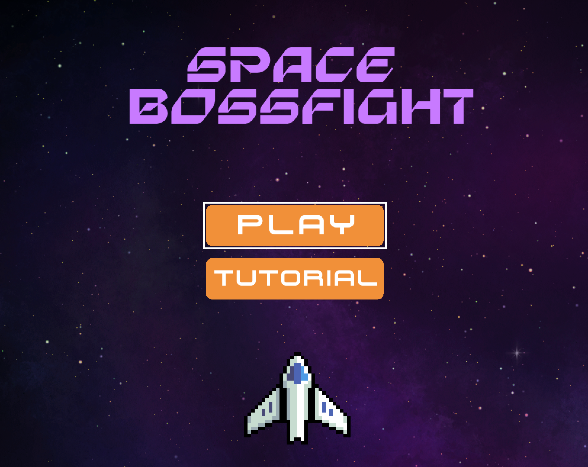
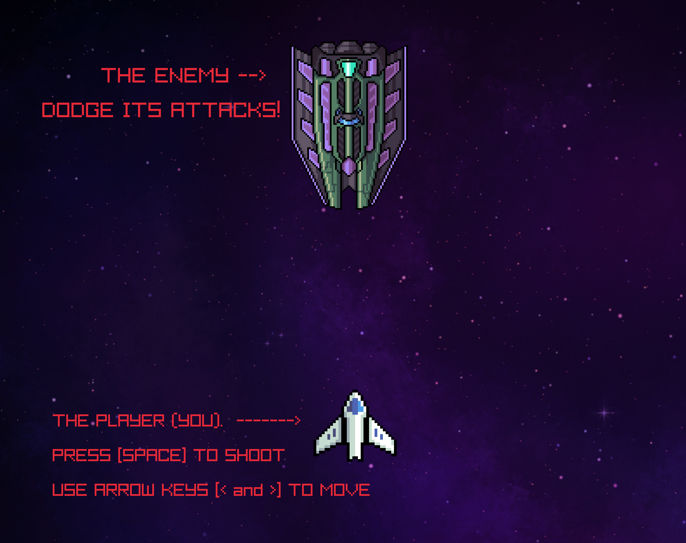
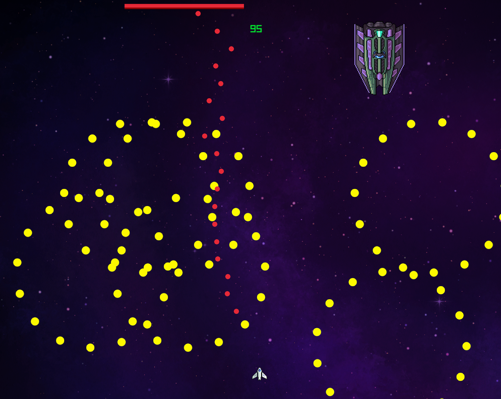
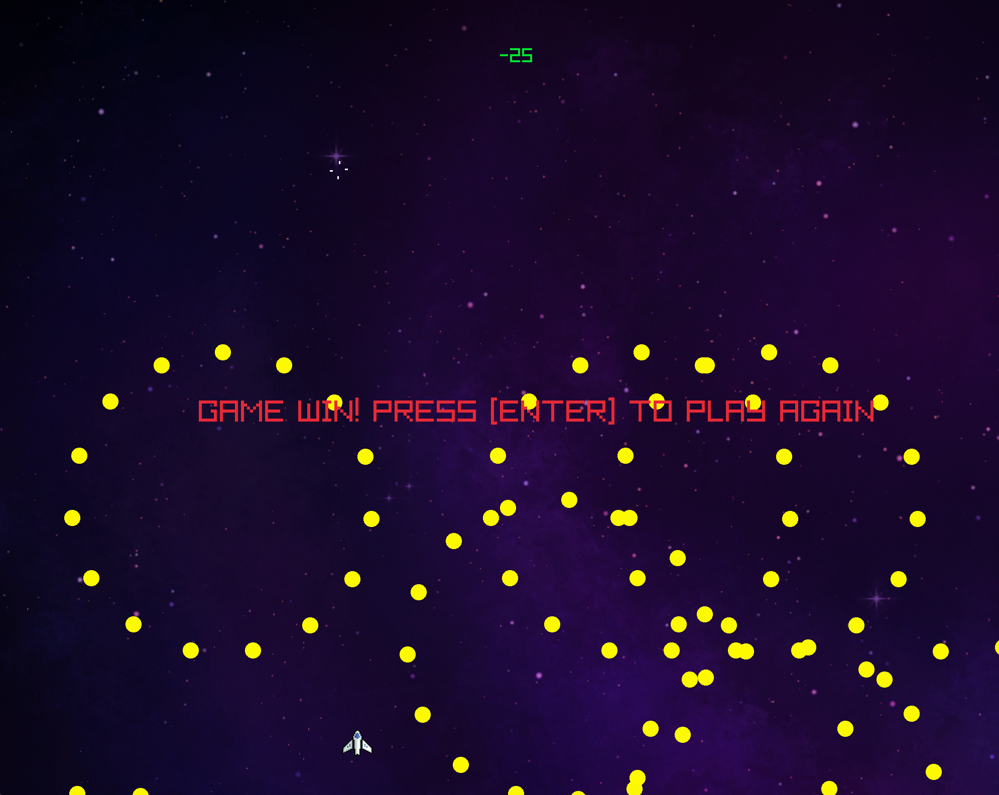

# pang_replica
## Description
This game is my upgrade of "Pang", with inspiration from games like Galaga or other
space-themed or bullet hell games like Tohou. The game is centered around the player 
fighting a "boss" enemy, a giant spaceship, who is moving around near the top of the 
screen and shooting at the player, while the player is moving left and right along 
the bottom of the screen, trying to weave in and out to dodge the boss' attacks, and
simultaneously firing back to defeat it.

## Key Features
The main features of my game are the side-to-side movement pattern of the player, which
was inspired by the movement of the player in Pang, the bullets that the player fire
at the boss, and of course the boss itself. The boss comes with several features 
packed into it, with the figure-8 movement pattern, and the attack of firing three 
rotating circles of bullets at the player. Additionally, small things are added, like
a tutorial with instructions accessible from the home screen, sound effects, a health
bar, and a death animation that plays when the boss is defeated.

## Pictures

## Resources used

https://www.fontspace.com/supreme-spike-font-f120395 
https://www.fontspace.com/sterion-font-f113971
https://gooseninja.itch.io/space-music-pack?download 
https://mixkit.co/free-sound-effects/space-shooter/
https://destroyanad.itch.io/simple-muzzle-flashes
https://foozlecc.itch.io/void-fleet-pack-2?download
https://digitalmoons.itch.io/free-space-background

## Demo link
https://drive.google.com/file/d/1QQ01skMsDOpFVZrR2wpF0OZme8c91KO0/view?usp=share_link
